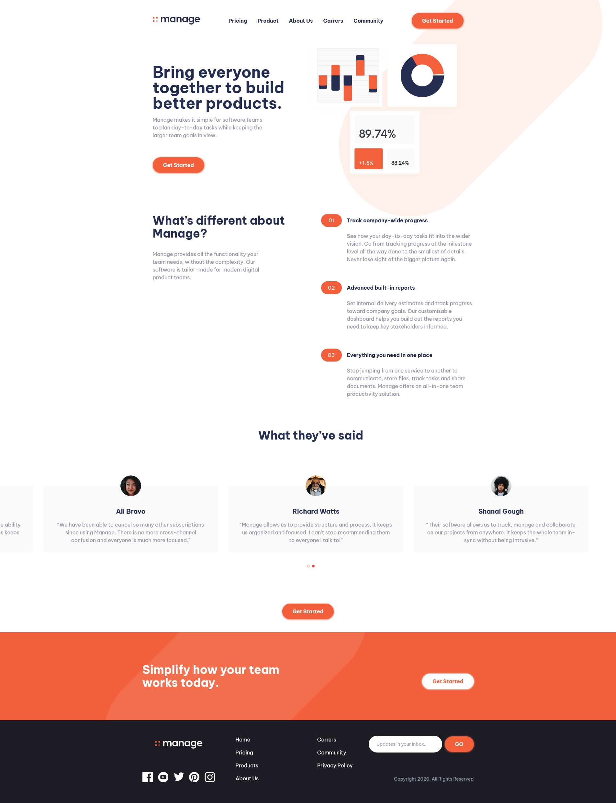

# Frontend Mentor - Manage landing page solution

This is a solution to the [Manage landing page challenge on Frontend Mentor](https://www.frontendmentor.io/challenges/manage-landing-page-SLXqC6P5). Frontend Mentor challenges help you improve your coding skills by building realistic projects.

## Table of contents

-   [Overview](#overview)
    -   [The challenge](#the-challenge)
    -   [Screenshot](#screenshot)
    -   [Links](#links)
-   [My process](#my-process)
    -   [Built with](#built-with)
    -   [What I learned](#what-i-learned)
    -   [Continued development](#continued-development)
-   [Author](#author)

## Overview

### The challenge

Users should be able to:

-   View the optimal layout for the site depending on their device's screen size
-   See hover states for all interactive elements on the page
-   See all testimonials in a horizontal slider
-   (WIP)Receive an error message when the newsletter sign up `form` is submitted if:
    -   The `input` field is empty
    -   The email address is not formatted correctly

### Screenshot

### Links

-   Solution URL: [https://your-solution-url.com](https://github.com/JuaniSilva/manage-landing-challenge)
-   Live Site URL: [https://juanisilva.github.io/manage-landing-challenge/](https://juanisilva.github.io/manage-landing-challenge/)

## My process

### Built with

-   Semantic HTML5 markup
-   Flexbox
-   CSS Grid
-   Mobile-first workflow
-   [Astro](https://astro.build/) - Astro is an all-in-one web framework for building fast, content-focused websites.
-   [React](https://reactjs.org/) - JS library
-   [TailwindCSS](https://tailwindcss.com/) - For styles

### What I learned

Building this landing I learned astro since it was my first time using it. Also learned to style list numbers markers which was a solution that I hadn't tried before (maybe it wasn't the best solution but my goal was to experiment with it)

### Continued development

I still need to finish the input validation and add some background images but I'm happy with the result I achieved. On the other hand, the slider needs some finals touches which I will try to find out how to fix the minor bug it has.

## Author

-   Website - [Juani Silva](https://github.com/JuaniSilva)
-   Frontend Mentor - [@JuaniSilva](https://www.frontendmentor.io/profile/JuaniSilva)
-   Twitter - [@Juani_Silva13](https://twitter.com/Juani_Silva13)
